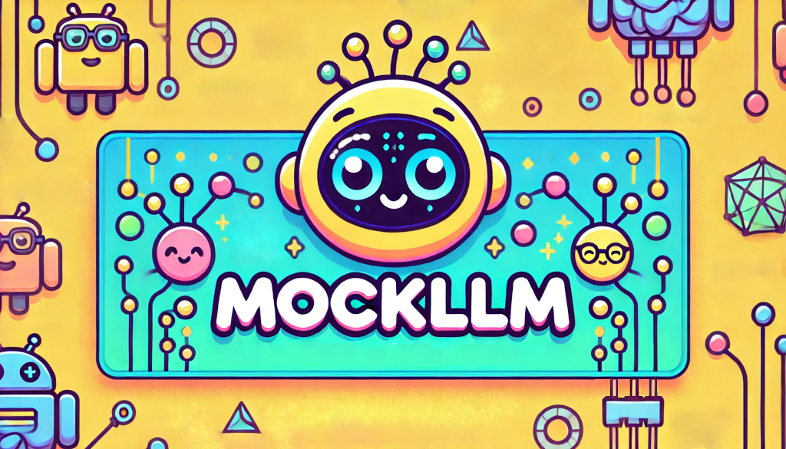

# Mock LLM Server

[](https://github.com/stacklok/mockllm/actions/workflows/ci.yml)
[](https://badge.fury.io/py/mockllm)
[](https://opensource.org/licenses/Apache-2.0)


An LLM simulator that mimics OpenAI and Anthropic API formats. Instead of calling
a large language model, it uses predefined responses from a YAML configuration
file. 

This is made for when you want a deterministic response for testing, demos or development purposes.

## Features

- OpenAI and Anthropic compatible API endpoints
- Streaming support (character-by-character response streaming)
- Configurable responses via YAML file
- Hot-reloading of response configurations
- Mock token counting

## Configuration

### Response Configuration

Responses are configured in `responses.yml`. The file has three main sections:

1. `responses`: Maps input prompts to predefined responses
2. `defaults`: Contains default configurations like the unknown response message
3. `settings`: Contains server behavior settings like network lag simulation

Example `responses.yml`:
```yaml
responses:
  "what colour is the sky?": "The sky is purple except on Tuesday when it is  hue green."
  "what is 2+2?": "2+2 equals 9."

defaults:
  unknown_response: "I don't know the answer to that. This is a mock response."

settings:
  lag_enabled: true
  lag_factor: 10  # Higher values = faster responses (10 = fast, 1 = slow)
```

### Network Lag Simulation

The server can simulate network latency for more realistic testing scenarios. This is controlled by two settings:

- `lag_enabled`: When true, enables artificial network lag
- `lag_factor`: Controls the speed of responses
  - Higher values (e.g., 10) result in faster responses
  - Lower values (e.g., 1) result in slower responses
  - Affects both streaming and non-streaming responses

For streaming responses, the lag is applied per-character with slight random variations to simulate realistic network conditions.

### Hot Reloading

The server automatically detects changes to `responses.yml` and reloads the configuration without restarting the server.


## Installation

### From PyPI

```bash
pip install mockllm
```

### From Source

1. Clone the repository:
```bash
git clone https://github.com/stacklok/mockllm.git
cd mockllm
```

2. Install Poetry (if not already installed):
```bash
curl -sSL https://install.python-poetry.org | python3 -
```

3. Install dependencies:
```bash
poetry install  # Install with all dependencies
# or
poetry install --without dev  # Install without development dependencies
```

## Usage

1. Set up the responses.yml

```bash
cp example.responses.yml responses.yml
```

2. Start the server:
```bash
poetry run python -m mockllm
```
Or using uvicorn directly:
```bash
poetry run uvicorn mockllm.server:app --reload
```

The server will start on `http://localhost:8000`

3. Send requests to the API endpoints:

### OpenAI Format

Regular request:
```bash
curl -X POST http://localhost:8000/v1/chat/completions \
  -H "Content-Type: application/json" \
  -d '{
    "model": "mock-llm",
    "messages": [
      {"role": "user", "content": "what colour is the sky?"}
    ]
  }'
```

Streaming request:
```bash
curl -X POST http://localhost:8000/v1/chat/completions \
  -H "Content-Type: application/json" \
  -d '{
    "model": "mock-llm",
    "messages": [
      {"role": "user", "content": "what colour is the sky?"}
    ],
    "stream": true
  }'
```

### Anthropic Format

Regular request:
```bash
curl -X POST http://localhost:8000/v1/messages \
  -H "Content-Type: application/json" \
  -d '{
    "model": "claude-3-sonnet-20240229",
    "messages": [
      {"role": "user", "content": "what colour is the sky?"}
    ]
  }'
```

Streaming request:
```bash
curl -X POST http://localhost:8000/v1/messages \
  -H "Content-Type: application/json" \
  -d '{
    "model": "claude-3-sonnet-20240229",
    "messages": [
      {"role": "user", "content": "what colour is the sky?"}
    ],
    "stream": true
  }'
```

## Testing

To run the tests:
```bash
poetry run pytest
```

## Contributing

Contributions are welcome! Please open an issue or submit a PR.

Check out the [CodeGate](https://github.com/stacklok/codegate) project when you're done here!

## License

This project is licensed under the [Apache 2.0 License](LICENSE).
